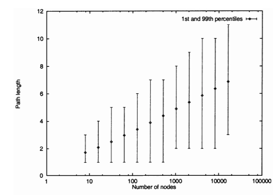

# chord-dht

Implementation of a Chord DHT. 2nd assignment for course on distributed system principles

## Installation and Setup

TODO: installation and setup instructions


## Note about Python version for \*nix Systems

\*nix refers to Unix (Mac), Linux, etc.
You may have a different version of Python 3 installed. If it works, great! If not, you'll want to follow these instructions to
get set up with Python 3.9

If you're able to work with a different version of Python 3, you'll use a different command than `python3.9` in the provided code snippets.
Your command may likely be `python3` or `python3.x` (where `x` is the minor version), so adjust accordingly. The code snippets for *nix systems
are written with the assumption of running version 3.9 and the python interpretter is registered with the system as `python3.9`.

### Installing Python 3.9 on *nix Systems

TODO: installation instructions for python3.9 on *nix

## Tasks

### Notes on running the code

Each task (when relevant) has a code snippet of command line execution, showing how each test-file can be run and what sample output
looks like. A Windows environment using Powershell is assumed except for the Mininet tasks, in which I assume an Ubuntu VM
(or directly installed Ubuntu system).

The instructions will be the same for a \*nix environment except for what your system may alias the python command to.
Often in \*nix, the `py` will be replaced with `python3.9` or `python3`.

For example, the following command in Powershell:

```powershell
> py .\src\test\hash_function.py hashme!
[output]
```

will be this, in an Ubuntu environment where python is aliased to `python3.9`:

```bash
$ python3.9 ./src/test/hash_function.py hashme!
[output]
```

### Notes about Random Sample

For more fidelity in the the test environment, Python's `random` library was used, but for the sake of reproducibility,
a seed is always set before any random calls are made. If you run this code following the provided instructions,
your output is not expected to vary.

### Finish Chord Worksheet - 20 pts

See [chord-worksheet.docx](./chord-worksheet.docx)

### Write a hashing function - 5 pts

Implemented with the MD5 algorithm. implemented in [hash_function.py](./src/app/hash_function.py)

Run the manual test with the command from the root of this repository:

```powershell
> py .\src\test\hash_function.py hashme!
the hash of hashme! is 229
```

### Implement mod-N load balancing - 10 pts

Random selection is used for the hashed strings.
The test prints the assignment of 10 random keys each to 1 of 50 "server nodes".
Then, after adding a 51st node, the new key assignment is printed out.

During a sample run, `9` out of the `10` keys were assigned to a new node during the second run.

```powershell
> py .\src\test\mod_n_load_balancing.py

--------------------------------
initial configuration
--------------------------------

keys in server server_72:
        cached_data_80
keys in server server_9:
        cached_data_0
keys in server server_97:
        cached_data_78
keys in server server_90:
        cached_data_63
keys in server server_69:
        cached_data_42
keys in server server_40:
        cached_data_31
keys in server server_50:
        cached_data_93
keys in server server_61:
        cached_data_41
keys in server server_45:
        cached_data_90
keys in server server_71:
        cached_data_8

--------------------------------
after adding 1 new server
--------------------------------

keys in server server_92:
        cached_data_80
keys in server server_77:
        cached_data_0
keys in server server_73:
        cached_data_78
keys in server server_90:
        cached_data_63
keys in server server_25:
        cached_data_42
keys in server server_75:
        cached_data_31
keys in server server_98:
        cached_data_93
keys in server server_33:
        cached_data_41
keys in server server_38:
        cached_data_90
keys in server server_60:
        cached_data_8
```

### Implement consistent ring load balancing - 10 pts

This is the same manual test as mod-n load balancing except that consistent hashing is used
as the key-assignment algorithm instead of mod-n.

When the 51st server was added, 0 keys had to be reassigned to a new server.

```powershell
> py .\src\test\consistent_hashing_load_balancing.py

--------------------------------
initial configuration
--------------------------------

keys in server server_71:
        cached_data_80
        cached_data_93
keys in server server_38:
        cached_data_0
keys in server server_18:
        cached_data_78
keys in server server_27:
        cached_data_63
keys in server server_92:
        cached_data_42
keys in server server_89:
        cached_data_31
keys in server server_25:
        cached_data_41
keys in server server_36:
        cached_data_90
keys in server server_68:
        cached_data_8

--------------------------------
after adding 1 new server
--------------------------------

keys in server server_71:
        cached_data_80
        cached_data_93
keys in server server_38:
        cached_data_0
keys in server server_18:
        cached_data_78
keys in server server_27:
        cached_data_63
keys in server server_92:
        cached_data_42
keys in server server_89:
        cached_data_31
keys in server server_25:
        cached_data_41
keys in server server_36:
        cached_data_90
keys in server server_68:
        cached_data_8
```

### Implement Naïve Chord Routing - 10 pts

Naïve Chord Routing is a ring of servers, each given an id (hash value) in an address space.
Each server knows about its successor and nothing else. You can search for a key in the address space
only by recursively checking the next server.

The manual test harness calculates the average hop-count to find a random key from a random server.
This average is calculated for a ring of 50 nodes, as well as a ring of 100 nodes.

Run the test as follows:

```powershell
> py .\src\test\naive_chord.py
for 50 nodes, the average hop size is: 24.5
for 100 nodes, the average hop size is: 49.5
```

The average hop size was found to be 24.5 for a 50-node network and 49.5 for a 100-node network.
This is a naïve algorithm, and the results are just as intuitive as the algorithm's approach.
The average number of hops for the naïve algorithm is similar to asking what the average arc-length
between any 2 points in a circle happens to be. It's going to be half the circumference (or half the number of nodes).
In the case of 50, we expect 25 (I got 24.5) and in the case of 100, we expect 50 (I got 49.5).
This algorithm is expected to scale the number of hops linearly.

### Build Finger Tables - 10 pts

Run the test harness for the finger-table builder using the indicated command.
You should get the following output as well.

You will see a printout of the configuration of the server ring (node name and hashed id),
followed by a printout of the nodes in a specific server's finger table.
Under the current configuration, this server will be named "server_65", which is hashed to address 170.

```powershell
> py .\src\test\finger_table.py
--------------------------------
node configuration (name: id)
--------------------------------
server_62: 16
server_33: 31
server_97: 54
server_5: 69
server_51: 98
server_53: 131
server_65: 170
server_49: 171
server_61: 172
server_38: 221
--------------------------------
node (name: id)
    server_65: 170

finger table (k-value -- name: id)
1 -- server_49: 171
2 -- server_61: 172
3 -- server_38: 221
4 -- server_38: 221
5 -- server_38: 221
6 -- server_38: 221
7 -- server_62: 16
8 -- server_97: 54
--------------------------------
```

### Implement Chord Routing - 10 Pts

Run the following command to see the test harness result of the Chord Routing algorithm.
It is the same ring "network" as was used in Naïve Chord Routing and the same form of output,
but with the Chord algorithm instead of the Naïve Chord algorithm.

```powershell
> py .\src\test\chord_routing.py
for 50 nodes, the average hop size is: 2.7958
for 100 nodes, the average hop size is: 3.1334
```

First, most notably, the average hop size is much smaller than that of the Naïve algorithm.
Secondly, more subtly, you can note that the hop size increased on average as the number of nodes increased.
This result can be verified by Stoica et al. in their theoretical results on the Chord algorithm.



Stoica et al. show a similar trend and posited that the trend is that a path length is about
_(1/2)log<sub>2</sub>N_, where _N_ is the number of nodes.

## References

Stoica, I., et al. “Chord: A Scalable Peer-To-Peer Lookup Protocol for Internet Applications.” IEEE/ACM Transactions on Networking, vol. 11, no. 1, Feb. 2003, pp. 17–32, 10.1109/tnet.2002.808407.
